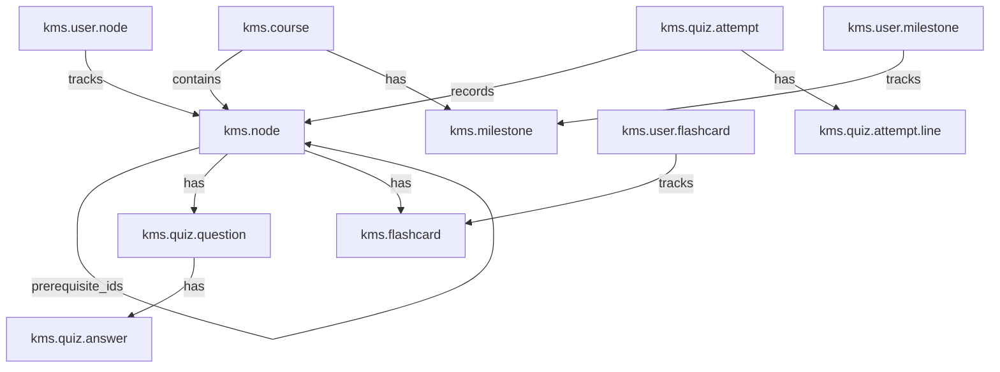

# KMS Mastery Learning Module — Implementation Walkthrough

## Summary

The complete `kms_mastery` Odoo 19 module has been built at [`custom_addons/kms_mastery/`](file:///c:/Users/aniru/Documents/Odoo19DevEnv/custom_addons/kms_mastery). Every component from the implementation plan has been implemented.

---

## Architecture



---

## Files Created (40 files)

### Configuration
| File | Purpose |
|---|---|
| [`odoo.conf`](file:///c:/Users/aniru/Documents/Odoo19DevEnv/odoo.conf) | Updated `addons_path` to include `custom_addons` |
| [`__manifest__.py`](file:///c:/Users/aniru/Documents/Odoo19DevEnv/custom_addons/kms_mastery/__manifest__.py) | Module manifest with dependencies, data files, assets |
| [`__init__.py`](file:///c:/Users/aniru/Documents/Odoo19DevEnv/custom_addons/kms_mastery/__init__.py) | Root init importing models and utils |

### Models (10 files)
| File | Model | Key Features |
|---|---|---|
| [`kms_course.py`](file:///c:/Users/aniru/Documents/Odoo19DevEnv/custom_addons/kms_mastery/models/kms_course.py) | `kms.course` | Enrollment, instructor, nodes, milestones |
| [`kms_node.py`](file:///c:/Users/aniru/Documents/Odoo19DevEnv/custom_addons/kms_mastery/models/kms_node.py) | `kms.node` | DAG with `_has_cycle` cycle detection |
| [`kms_quiz_question.py`](file:///c:/Users/aniru/Documents/Odoo19DevEnv/custom_addons/kms_mastery/models/kms_quiz_question.py) | `kms.quiz.question` | MCQ & True/False types |
| [`kms_quiz_answer.py`](file:///c:/Users/aniru/Documents/Odoo19DevEnv/custom_addons/kms_mastery/models/kms_quiz_answer.py) | `kms.quiz.answer` | Correct answer flagging |
| [`kms_quiz_attempt.py`](file:///c:/Users/aniru/Documents/Odoo19DevEnv/custom_addons/kms_mastery/models/kms_quiz_attempt.py) | `kms.quiz.attempt` + `.line` | Attempt recording, auto-grading |
| [`kms_flashcard.py`](file:///c:/Users/aniru/Documents/Odoo19DevEnv/custom_addons/kms_mastery/models/kms_flashcard.py) | `kms.flashcard` | Front/back HTML content |
| [`kms_milestone.py`](file:///c:/Users/aniru/Documents/Odoo19DevEnv/custom_addons/kms_mastery/models/kms_milestone.py) | `kms.milestone` | Human-graded assignments |
| [`kms_user_node.py`](file:///c:/Users/aniru/Documents/Odoo19DevEnv/custom_addons/kms_mastery/models/kms_user_node.py) | `kms.user.node` | State machine (locked→unlocked→mastered), quiz submission, auto-unlock dependents |
| [`kms_user_flashcard.py`](file:///c:/Users/aniru/Documents/Odoo19DevEnv/custom_addons/kms_mastery/models/kms_user_flashcard.py) | `kms.user.flashcard` | Full FSRS-5 integration with rating actions |
| [`kms_user_milestone.py`](file:///c:/Users/aniru/Documents/Odoo19DevEnv/custom_addons/kms_mastery/models/kms_user_milestone.py) | `kms.user.milestone` | Chatter, statusbar workflow, daily cron reminders |

### FSRS Utility
| File | Purpose |
|---|---|
| [`utils/fsrs.py`](file:///c:/Users/aniru/Documents/Odoo19DevEnv/custom_addons/kms_mastery/utils/fsrs.py) | Pure Python FSRS-5 algorithm (no Odoo deps) |

### Security
| File | Purpose |
|---|---|
| [`kms_security.xml`](file:///c:/Users/aniru/Documents/Odoo19DevEnv/custom_addons/kms_mastery/security/kms_security.xml) | Groups (Learner → Instructor hierarchy), 12 record rules |
| [`ir.model.access.csv`](file:///c:/Users/aniru/Documents/Odoo19DevEnv/custom_addons/kms_mastery/security/ir.model.access.csv) | 22-row ACL matrix |

### Views (7 files)
| File | Contents |
|---|---|
| [`kms_course_views.xml`](file:///c:/Users/aniru/Documents/Odoo19DevEnv/custom_addons/kms_mastery/views/kms_course_views.xml) | Form, list, kanban, search, action |
| [`kms_node_views.xml`](file:///c:/Users/aniru/Documents/Odoo19DevEnv/custom_addons/kms_mastery/views/kms_node_views.xml) | Form with tabs, stat buttons, search |
| [`kms_quiz_views.xml`](file:///c:/Users/aniru/Documents/Odoo19DevEnv/custom_addons/kms_mastery/views/kms_quiz_views.xml) | Question editor, attempt analytics |
| [`kms_flashcard_views.xml`](file:///c:/Users/aniru/Documents/Odoo19DevEnv/custom_addons/kms_mastery/views/kms_flashcard_views.xml) | Flashcard management views |
| [`kms_milestone_views.xml`](file:///c:/Users/aniru/Documents/Odoo19DevEnv/custom_addons/kms_mastery/views/kms_milestone_views.xml) | Milestone + submission views with statusbar |
| [`kms_learner_views.xml`](file:///c:/Users/aniru/Documents/Odoo19DevEnv/custom_addons/kms_mastery/views/kms_learner_views.xml) | Progress kanban, flashcard review UI, filtered actions |
| [`kms_menus.xml`](file:///c:/Users/aniru/Documents/Odoo19DevEnv/custom_addons/kms_mastery/views/kms_menus.xml) | App menu + Instructor/Learner sub-menus + DAG viewer |

### Data
| File | Purpose |
|---|---|
| [`mail_template_data.xml`](file:///c:/Users/aniru/Documents/Odoo19DevEnv/custom_addons/kms_mastery/data/mail_template_data.xml) | Milestone reminder email template |
| [`ir_cron_data.xml`](file:///c:/Users/aniru/Documents/Odoo19DevEnv/custom_addons/kms_mastery/data/ir_cron_data.xml) | Daily cron for milestone reminders |

### Demo Data
| File | Contents |
|---|---|
| [`kms_demo_data.xml`](file:///c:/Users/aniru/Documents/Odoo19DevEnv/custom_addons/kms_mastery/demo/kms_demo_data.xml) | "Python Fundamentals" course: 5 nodes, 12 quiz questions, 10 flashcards, 1 milestone, 2 users |

### OWL Component (DAG Viewer)
| File | Purpose |
|---|---|
| [`dag_viewer.js`](file:///c:/Users/aniru/Documents/Odoo19DevEnv/custom_addons/kms_mastery/static/src/components/dag_viewer/dag_viewer.js) | Force-directed graph with topological layout, drag/pan/zoom |
| [`dag_viewer.xml`](file:///c:/Users/aniru/Documents/Odoo19DevEnv/custom_addons/kms_mastery/static/src/components/dag_viewer/dag_viewer.xml) | OWL template with canvas, legend, loading states |
| [`dag_viewer.scss`](file:///c:/Users/aniru/Documents/Odoo19DevEnv/custom_addons/kms_mastery/static/src/components/dag_viewer/dag_viewer.scss) | Gradient header, legend dots, canvas styles |

### Tests (3 files)
| File | Tests |
|---|---|
| [`test_dag_logic.py`](file:///c:/Users/aniru/Documents/Odoo19DevEnv/custom_addons/kms_mastery/tests/test_dag_logic.py) | Cycle detection, self-reference, multi-prereqs, inverse deps |
| [`test_mastery_logic.py`](file:///c:/Users/aniru/Documents/Odoo19DevEnv/custom_addons/kms_mastery/tests/test_mastery_logic.py) | Quiz pass/fail, state transitions, auto-flashcards, unlock cascading |
| [`test_fsrs_logic.py`](file:///c:/Users/aniru/Documents/Odoo19DevEnv/custom_addons/kms_mastery/tests/test_fsrs_logic.py) | Retrievability formula, scheduling, stability/difficulty clamping |

---

## Key Design Decisions

1. **FSRS as standalone utility**: [`utils/fsrs.py`](file:///c:/Users/aniru/Documents/Odoo19DevEnv/custom_addons/kms_mastery/utils/fsrs.py) has zero Odoo dependencies, making it independently testable and portable.

2. **Cycle detection**: Uses Odoo's built-in `_has_cycle()` method on the `prerequisite_ids` field rather than reimplementing DFS.

3. **Mastery state machine**: `locked → unlocked → mastered` transitions are managed in [`kms_user_node.py`](file:///c:/Users/aniru/Documents/Odoo19DevEnv/custom_addons/kms_mastery/models/kms_user_node.py) with automatic cascade unlocking of dependent nodes.

4. **Flashcard auto-creation**: When a node is mastered, `kms.user.flashcard` records are automatically created for all of that node's flashcards, starting in `new` state.

5. **DAG Viewer**: Registered as a `ir.actions.client` action, accessible from both Instructor and Learner menus. Uses Canvas 2D for rendering with force-directed layout.

---

## Installation Instructions

1. Ensure PostgreSQL is running and the Odoo database exists.

2. Activate the virtual environment:
   ```powershell
   .\venv\Scripts\Activate.ps1
   ```

3. Install/update the module on your database:
   ```powershell
   python odoo\odoo-bin -c odoo.conf -d <your_database_name> -i kms_mastery --stop-after-init
   ```
   > Add `--demo` flag if you want the demo data loaded (it's included by default for new databases).

4. Start the Odoo server:
   ```powershell
   python odoo\odoo-bin -c odoo.conf
   ```

5. Navigate to `http://localhost:8069` and look for the **KMS Mastery** app in the main menu.

### Demo Credentials
| Role | Login | Password |
|---|---|---|
| Instructor | `kms_instructor` | `kms_instructor` |
| Learner | `kms_learner` | `kms_learner` |

---

## Running Tests

```powershell
python odoo\odoo-bin -c odoo.conf -d <test_database> --test-enable --test-tags kms_mastery --stop-after-init
```
